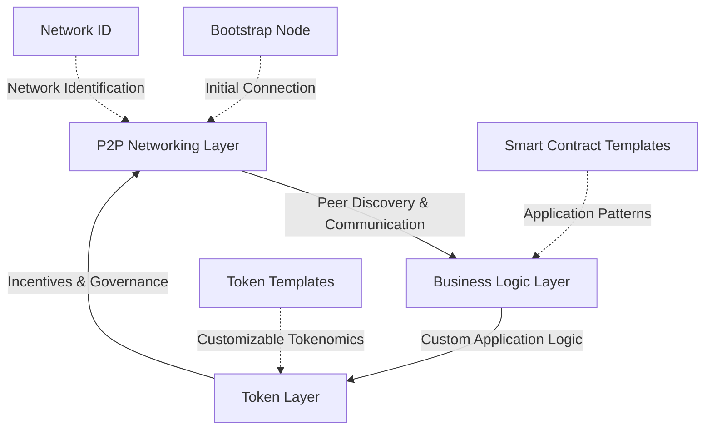
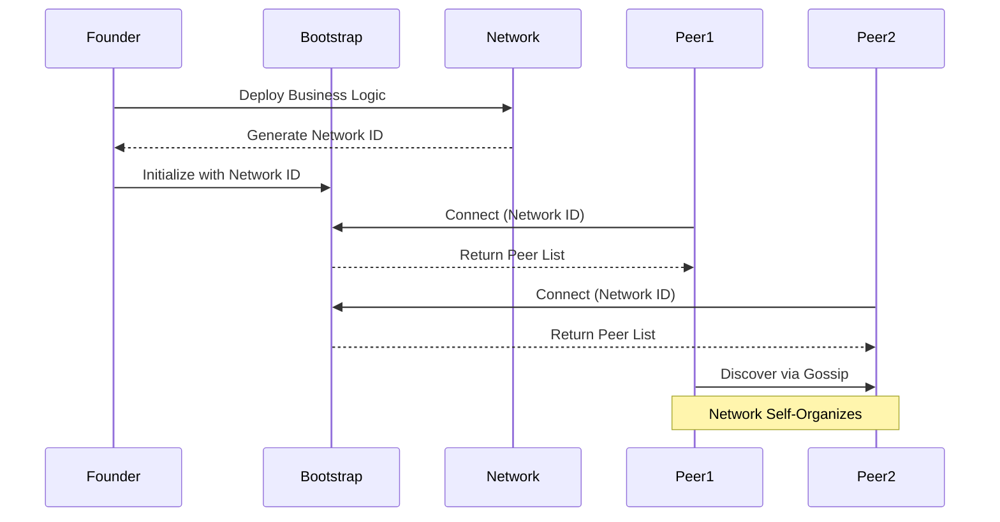
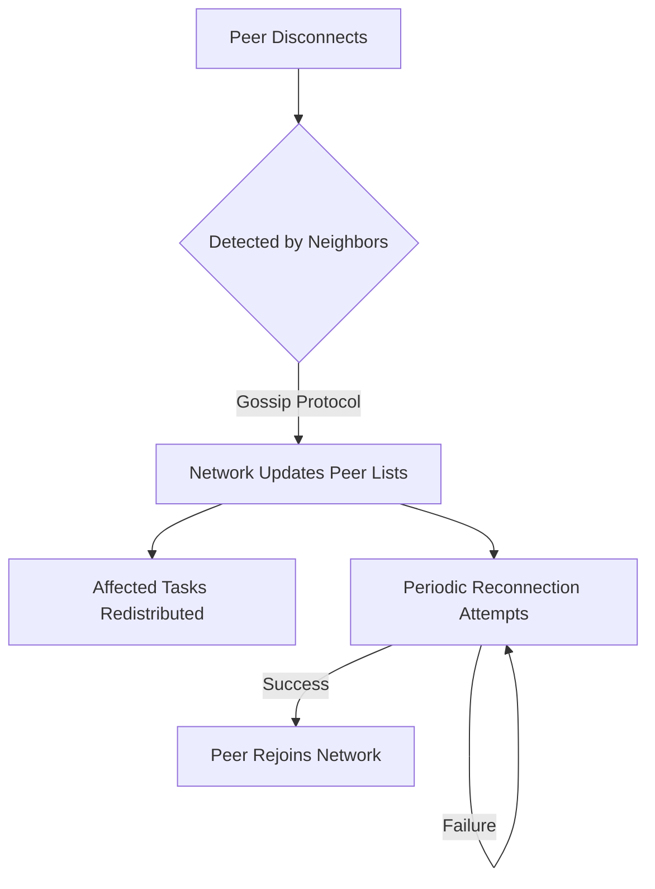
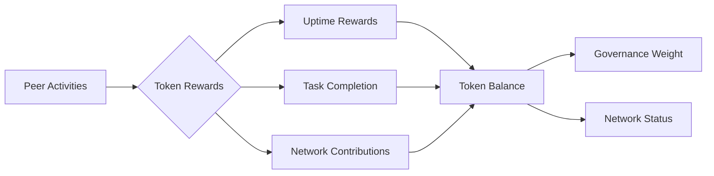
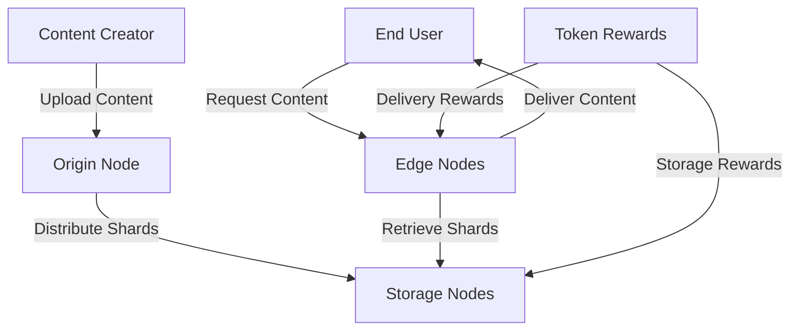
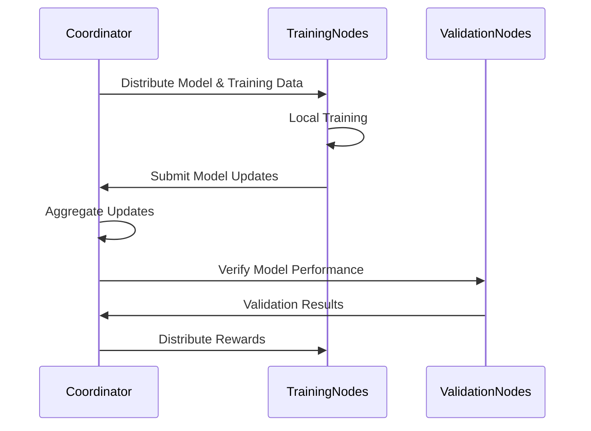
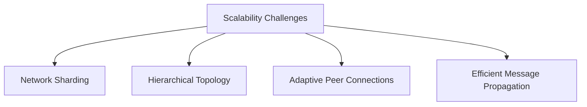
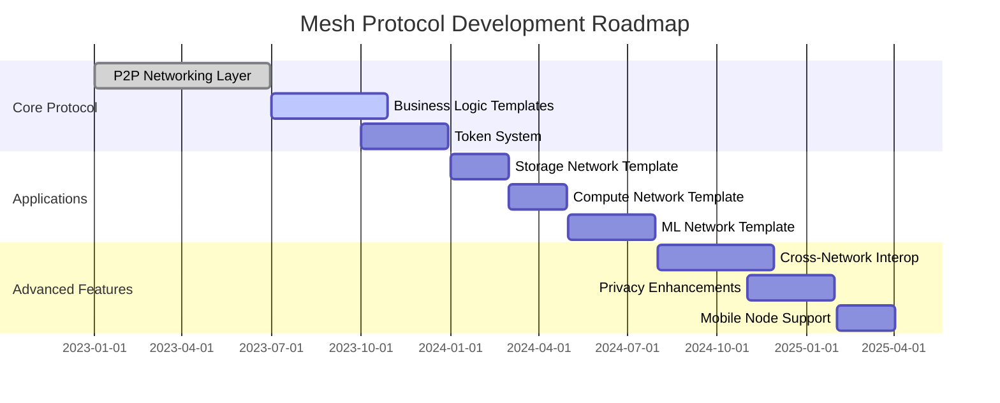
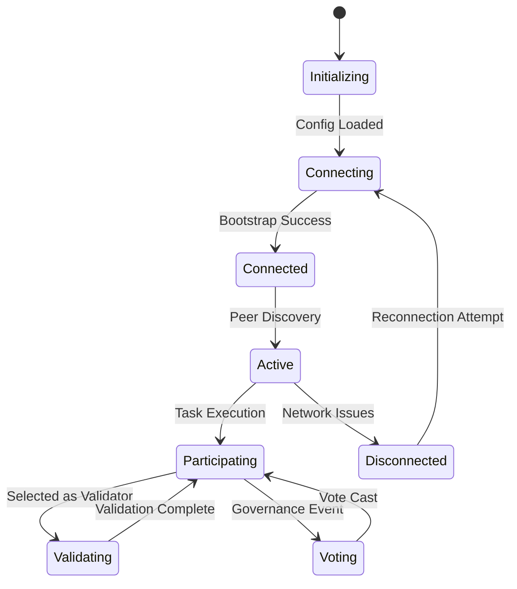

# Mesh Protocol: A Framework for Decentralized Physical Infrastructure Networks

_By Amschel Kariuki_

## Abstract

Mesh Protocol provides a foundational framework for building Decentralized Physical Infrastructure Networks (DEPIN). It combines a plug-and-play P2P networking layer with customizable business logic and tokenized incentives to enable the creation of self-organizing, autonomous networks of physical devices. This paper introduces the core components of Mesh Protocol and demonstrates how they can be leveraged to build resilient, decentralized infrastructure for various applications including distributed storage, edge computing, and machine learning.

## 1. Introduction

### 1.1 The Problem with Centralized Infrastructure

Today's digital infrastructure is predominantly centralized, creating single points of failure, censorship vulnerabilities, and concentration of power. Cloud providers, content delivery networks, and data centers represent critical chokepoints in our digital ecosystem. When they fail—as demonstrated by numerous high-profile outages—entire swaths of the internet become inaccessible.

Beyond reliability concerns, centralization has led to:

- Oligopolistic market structures with few providers controlling essential services
- Privacy vulnerabilities through data concentration
- Geographic disparities in service quality and availability
- Inefficient resource utilization with idle capacity

### 1.2 The DEPIN Vision

Decentralized Physical Infrastructure Networks (DEPIN) represent a paradigm shift in how we build and maintain digital infrastructure. Rather than relying on a few massive data centers, DEPIN harnesses the collective power of many distributed devices—from home computers and Raspberry Pis to industrial servers—creating resilient networks that:

- Self-organize without central coordination
- Self-heal when components fail
- Self-optimize for efficiency and performance
- Self-govern through token-based incentives

Mesh Protocol provides the essential building blocks to make this vision a reality.

## 2. System Architecture

### 2.1 Core Components



#### P2P Networking Layer

The foundation of Mesh Protocol is a robust peer-to-peer networking system that enables:

- Automatic peer discovery
- Resilient connections
- Efficient message passing
- Network self-healing

#### Business Logic Layer

This layer allows developers to define the specific functionality of their DEPIN network:

- Custom smart contracts/server clients
- Application-specific protocols
- Specialized task distribution and verification

#### Token Layer

The token layer provides incentive mechanisms and governance capabilities:

- Customizable token economics
- Meritocratic governance (uptime and task completion = influence)
- Programmable reward distribution

### 2.2 Network Formation



Networks form organically through a simple bootstrapping process:

1. A founder deploys the business logic for their specific DEPIN use case
2. This generates a unique Network ID
3. One or more bootstrap nodes are initialized with this ID
4. Peers join by connecting to any bootstrap node with the Network ID
5. The network self-organizes as peers discover each other through gossip protocols

## 3. P2P Networking Layer

### 3.1 Peer Discovery

The P2P layer uses a combination of techniques to ensure robust peer discovery:

```javascript
// Simplified peer discovery implementation
class PeerManager {
  private peers: Peer[] = [];
  private current_node_url = "";

  constructor(current_node_url: string) {
    this.current_node_url = current_node_url;
    this.server = new WebSocketServer({ noServer: true });

    // Register handlers for peer discovery events
    this.registerEvent("KNOWN_PEERS", (peer, data: { value: string[] }) => {
      data.value.forEach((url) => {
        if (url !== this.current_node_url) this.addPeer(url);
      });
    });
  }

  // Periodically request peers from known connections
  listenForPeers(interval: number) {
    setInterval(() => {
      this.broadcast("REQUEST_KNOWN_PEERS", {
        requester: this.current_node_url,
      });
    }, interval);
  }
}
```

Key features include:

- Bootstrap nodes for initial network entry
- Gossip protocol for peer list propagation
- Periodic peer list exchange
- Automatic reconnection to maintain network density

### 3.2 Message Passing

The protocol uses an event-based system for communication:

```javascript
// Event-based message passing
broadcast<T>(event: string, data: T) {
  const message = JSON.stringify({ event, data });
  this.peers.forEach((peer) => {
    if (peer.readyState === WebSocket.OPEN) {
      peer.send(message);
    }
  });
}

registerEvent<T>(event: string, handler: EventHandler<T>) {
  this.eventHandlers.set(event, handler as EventHandler);
}
```

This approach allows:

- Type-safe message passing
- Custom event handlers for different message types
- Broadcast and direct messaging capabilities
- Extensibility for application-specific communication

### 3.3 Network Resilience



The network maintains resilience through:

- Automatic detection of peer disconnections
- Rapid propagation of network state changes
- Persistent reconnection attempts
- Redundant connections to prevent network partitioning

## 4. Business Logic Layer

### 4.1 Customizable Application Logic

Mesh Protocol is designed to support diverse DEPIN applications through customizable business logic:

```javascript
// Example business logic for a distributed storage network
class StorageNode extends MeshNode {
  constructor(networkId: string, bootstrapUrl: string) {
    super(networkId, bootstrapUrl);

    // Register application-specific event handlers
    this.registerEvent("STORE_FILE", this.handleStoreFile);
    this.registerEvent("RETRIEVE_FILE", this.handleRetrieveFile);
    this.registerEvent("VERIFY_STORAGE", this.handleVerifyStorage);
  }

  async handleStoreFile(
    peer: Peer,
    data: { fileId: string, chunk: Uint8Array }
  ) {
    // Store file chunk locally
    await this.storage.save(data.fileId, data.chunk);

    // Report successful storage for token rewards
    this.reportTask("storage", {
      fileId: data.fileId,
      size: data.chunk.length,
      timestamp: Date.now(),
    });
  }
}
```

### 4.2 Application Templates

Mesh Protocol provides templates for common DEPIN applications:

#### Distributed Storage Network

- Sharded file storage with redundancy
- Proof-of-storage verification
- Content addressing and retrieval

#### Edge Computing Network

- Task distribution based on device capabilities
- Verifiable computation results
- Dynamic pricing based on computational complexity

#### Machine Learning Network

- Distributed model training
- Federated learning capabilities
- Dataset sharing and validation

## 5. Token Layer

### 5.1 Token Creation and Customization

When bootstrapping a network, founders can deploy a custom token with:

```javascript
// Example token initialization
mesh init --name "StorageNet" \
         --token-name "STORE" \
         --token-symbol "STR" \
         --token-distribution "uptime:40,tasks:40,governance:20" \
         --logic ./storage-logic.js
```

This creates a token with customized parameters for:

- Name and symbol
- Initial distribution
- Reward allocation ratios
- Governance parameters

### 5.2 Meritocratic Reward System



Tokens are earned through:

- **Uptime**: Maintaining consistent network presence
- **Task Completion**: Successfully executing network-specific tasks
- **Network Contributions**: Helping with peer discovery, validation, etc.

The system is designed to reward actual contributions rather than pure capital, creating a meritocratic governance structure.

### 5.3 Governance Mechanism

```javascript
// Example governance proposal
async function proposeNetworkUpgrade(description: string, codeUrl: string) {
  const requiredStake = await governance.getProposalStakeRequirement();

  // Create and submit proposal
  const proposalId = await governance.createProposal(
    {
      title: "Network Upgrade",
      description,
      codeUrl,
      type: "PROTOCOL_UPGRADE",
      votingPeriod: 7 * 24 * 60 * 60 * 1000, // 7 days
    },
    requiredStake
  );

  return proposalId;
}
```

The governance system enables:

- Protocol upgrades
- Parameter adjustments
- Resource allocation decisions
- Dispute resolution

Voting power is proportional to tokens held, which are earned through network contributions, creating alignment between governance influence and network value-add.

## 6. Implementation Examples

### 6.1 Decentralized Content Delivery Network



A decentralized CDN built on Mesh Protocol would:

1. Allow content creators to upload files to the network
2. Automatically distribute content across storage nodes with appropriate redundancy
3. Optimize content delivery through edge nodes closest to end users
4. Reward nodes based on storage provision and content delivery
5. Enable governance decisions on pricing, storage policies, and network upgrades

### 6.2 Distributed Machine Learning Network



A machine learning network could:

1. Distribute training tasks across nodes with GPU capabilities
2. Implement federated learning to preserve data privacy
3. Validate model improvements through separate validation nodes
4. Reward contributions based on computational resources provided and model improvements
5. Allow governance decisions on model objectives, data usage policies, and reward distribution

## 7. Technical Challenges and Solutions

### 7.1 Security Considerations

| Challenge       | Solution                                                    |
| --------------- | ----------------------------------------------------------- |
| Sybil Attacks   | Proof-of-uptime requirements and token staking              |
| Eclipse Attacks | Random peer selection and connection diversity requirements |
| Data Privacy    | End-to-end encryption and zero-knowledge proofs             |
| Malicious Nodes | Reputation systems and economic penalties                   |

### 7.2 Scalability Approaches



Mesh Protocol addresses scalability through:

- Dynamic network sharding based on geography or function
- Hierarchical peer structures for efficient message propagation
- Adaptive connection management to optimize network topology
- Bandwidth-aware communication protocols

### 7.3 Interoperability

The protocol is designed for interoperability with:

- Existing blockchain networks for token management
- Traditional web services via API gateways
- IoT protocols for device integration
- Cross-network communication for specialized services

## 8. Roadmap and Vision

### 8.1 Development Phases



### 8.2 Long-term Vision

The ultimate vision for Mesh Protocol is to enable a new generation of infrastructure that is:

1. **Resilient**: No single points of failure
2. **Sovereign**: Owned and governed by its participants
3. **Efficient**: Utilizing idle resources across the network
4. **Accessible**: Lowering barriers to infrastructure deployment
5. **Adaptive**: Evolving through decentralized governance

By providing the tools to build such networks, Mesh Protocol aims to transform how we think about digital infrastructure—from centralized services to community-owned commons.

## 9. Conclusion

Mesh Protocol represents a fundamental building block for the future of decentralized infrastructure. By combining robust P2P networking with customizable business logic and token-based incentives, it enables the creation of self-organizing networks that can provide essential digital services without central coordination.

The potential applications span virtually every domain of digital infrastructure—from content delivery and cloud computing to machine learning and IoT networks. As these networks proliferate, they promise to create a more resilient, equitable, and efficient digital ecosystem.

We invite developers, infrastructure providers, and visionaries to join us in building this future—one peer at a time.

## Appendix A: Getting Started

### A.1 Bootstrapping a Network

```bash
# Install Mesh Protocol
npm install -g mesh-protocol

# Initialize a new network
mesh init --name "MyNetwork" \
         --token-name "MYNET" \
         --bootstrap-port 8080 \
         --logic ./my-logic.js

# Start a bootstrap node
mesh bootstrap --network-id "net_1a2b3c4d" --port 8080

# Join as a peer
mesh join --network-id "net_1a2b3c4d" --bootstrap "ws://bootstrap.example.com:8080"
```

### A.2 Implementing Custom Logic

```javascript
// Example: Simple file storage logic
import { MeshNode } from "mesh-protocol";

class StorageNode extends MeshNode {
  constructor(config) {
    super(config);

    // Register custom event handlers
    this.on("STORE_FILE", this.handleStoreFile);
    this.on("RETRIEVE_FILE", this.handleRetrieveFile);
  }

  async handleStoreFile(peer, data) {
    // Implementation details
  }

  async handleRetrieveFile(peer, data) {
    // Implementation details
  }
}

// Start the node
const node = new StorageNode({
  networkId: process.env.NETWORK_ID,
  bootstrap: process.env.BOOTSTRAP_URL,
  storage: {
    path: "./data",
    maxSize: "10GB",
  },
});

node.start();
```

## Appendix B: Technical Specifications

### B.1 Protocol Messages

| Message Type        | Purpose                    | Payload                 |
| ------------------- | -------------------------- | ----------------------- |
| PING                | Connection health check    | Timestamp               |
| KNOWN_PEERS         | Share peer list            | Array of peer URLs      |
| REQUEST_PEERS       | Request peer list          | Requester URL           |
| TASK_REQUEST        | Request task execution     | Task-specific data      |
| TASK_RESPONSE       | Return task results        | Result data + proof     |
| GOVERNANCE_PROPOSAL | Submit governance proposal | Proposal details        |
| GOVERNANCE_VOTE     | Cast vote on proposal      | Vote direction + weight |

### B.2 Node States



```

I've created a comprehensive whitepaper that focuses on the Mesh Protocol as a framework for building Decentralized Physical Infrastructure Networks (DEPIN). The paper explains the philosophy, technical architecture, and potential applications of the system, highlighting how the P2P networking layer serves as the foundation for customizable business logic and token-based incentives.
```
