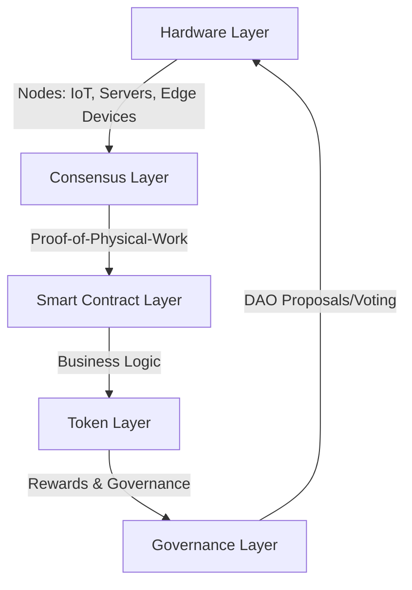
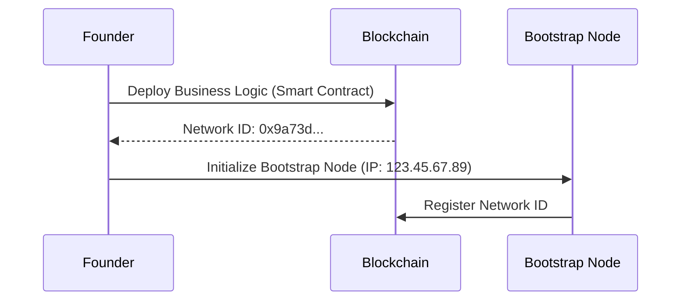
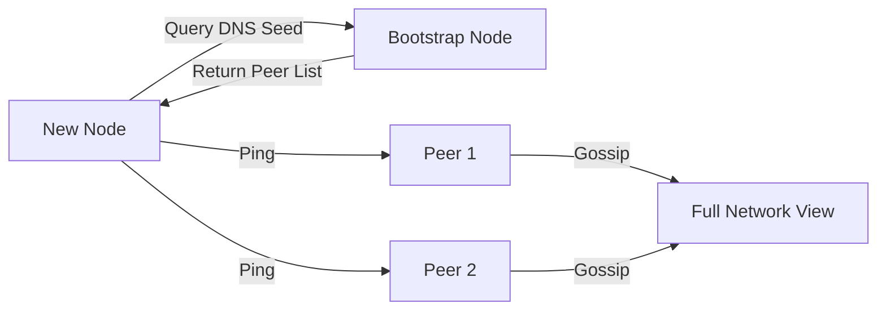
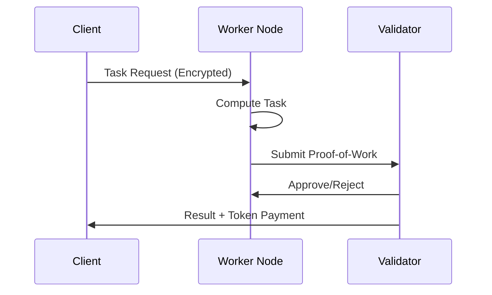
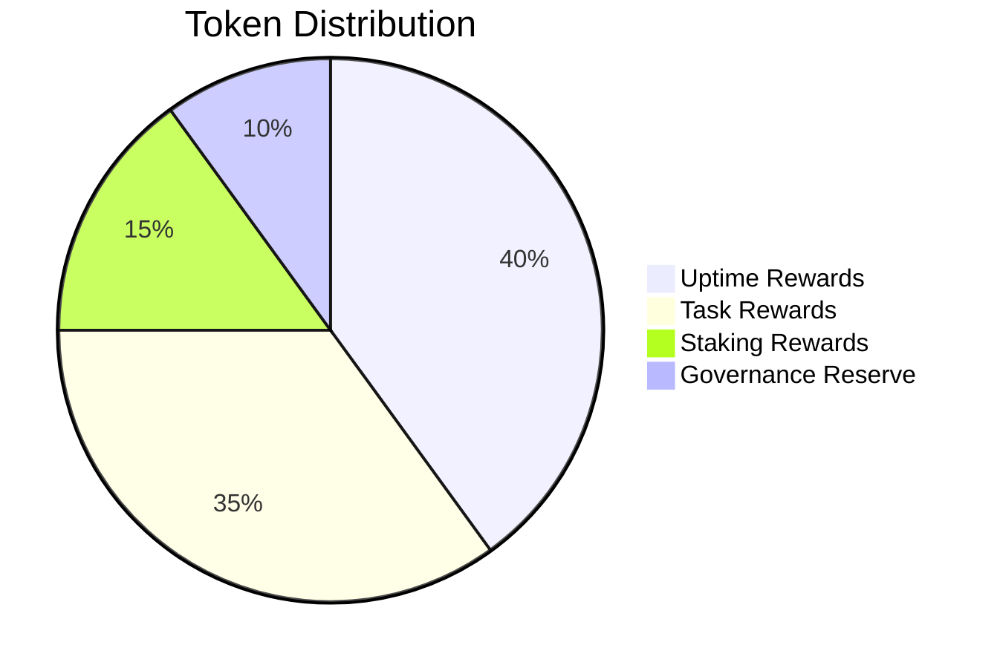
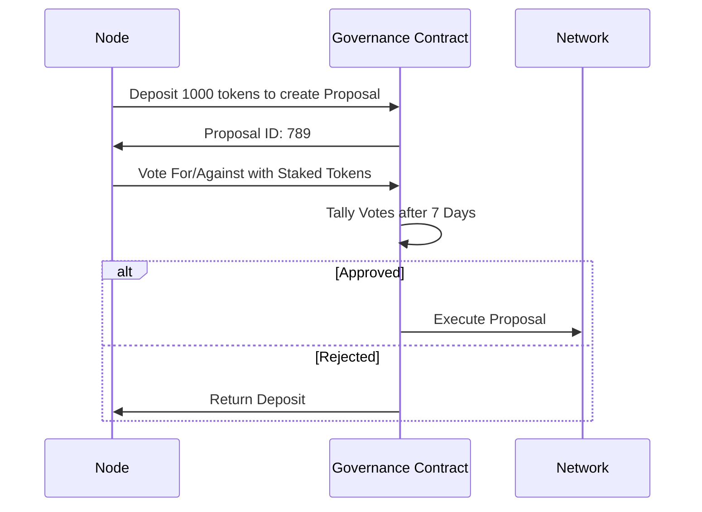
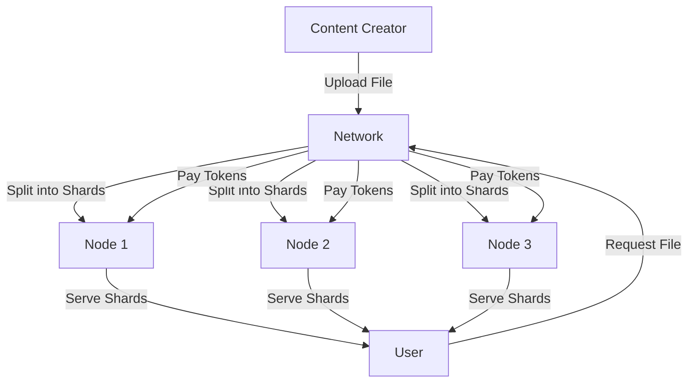
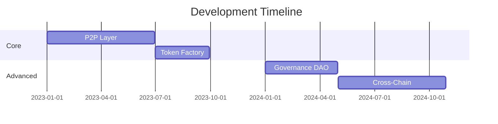
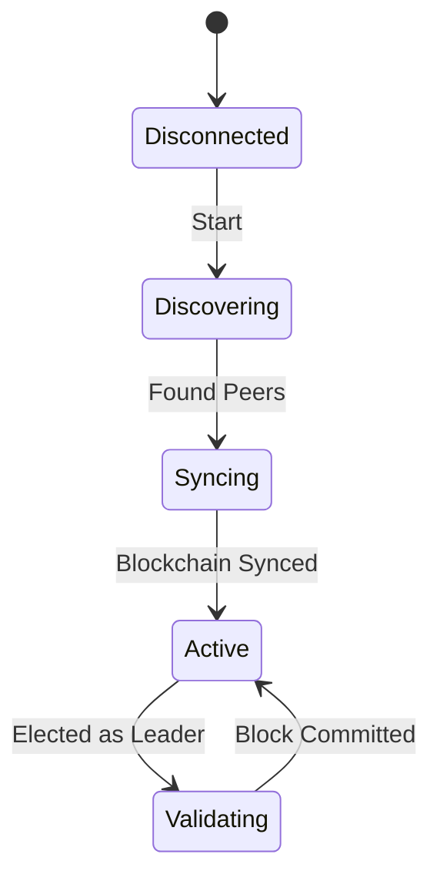

# Mesh Protocol: A Protocol for Autonomous Physical Networks

_By Amschel Kariuki_

---

## Abstract

Mesh Protocol enables the creation of self-organizing networks where physical devices (nodes) collaborate via:

1. **Decentralized Coordination** - P2P gossip for discovery/communication
2. **Tokenized Incentives** - Earn tokens for resources (compute, storage, uptime)
3. **On-Chain Governance** - Stake tokens to propose/vote on network rules

This paper details how these components interact to create antifragile infrastructure.

---

## 1. Network Architecture

### 1.1 Layers



### 1.2 Node Types

| Type      | Role                          | Example Devices    |
| --------- | ----------------------------- | ------------------ |
| Bootstrap | Initial network entry points  | Cloud servers      |
| Worker    | Execute tasks, earn tokens    | Raspberry Pi, GPUs |
| Validator | Verify work, secure consensus | Industrial PCs     |

## 2. Protocol Mechanics

### 2.1 Network Bootstrapping



**Code Example: Deploy a Network**

```solidity
// Business Logic Contract
contract EnergyGrid {
    function submitReading(uint kWh) public {
        require(msg.sender == registeredNode);
        Token.mint(msg.sender, kWh * REWARD_RATE);
    }
}
```

### 2.2 Peer Discovery



**Gossip Protocol:**

- Nodes exchange peer lists every 60s
- Use SWIM (Scalable Weakly-consistent Infection-style Process) for failure detection
- Kademlia DHT for efficient lookups

### 2.3 Task Execution



**Proof Types:**

- Proof-of-Compute: Hash of result + nonce
- Proof-of-Storage: Merkle root of stored data
- Proof-of-Uptime: Signed timestamps from peers

## 3. Token Economy

### 3.1 Token Flow



### 3.2 Governance Process



## 4. Use Case: Decentralized CDN

### 4.1 Workflow



**Key Metrics:**

- Redundancy: 3x replication by default
- Cost: 0.001 tokens/GB stored, 0.01 tokens/GB served

## 5. Challenges & Solutions

| Challenge        | Solution                     |
| ---------------- | ---------------------------- |
| Sybil Attacks    | Hardware attestation + stake |
| Data Privacy     | Shamir Secret Sharing        |
| Token Volatility | Algorithmic stablecoin pools |

## 6. Roadmap



## 7. Conclusion

Mesh Protocol transforms physical infrastructure into living networks that:

- Self-fund via tokenized participation
- Self-repair via P2P gossip
- Self-improve via on-chain governance

Join the movement to rebuild infrastructure as a commons.

## Appendices

### A.1 Network Bootstrap Code

```bash
# Install
npm install -g mesh-protocol

# Start Network
mesh init --name "MyDEPIN" \
         --token TOKEN \
         --logic ./energy-grid.sol
```

### A.2 Full Node Diagram


